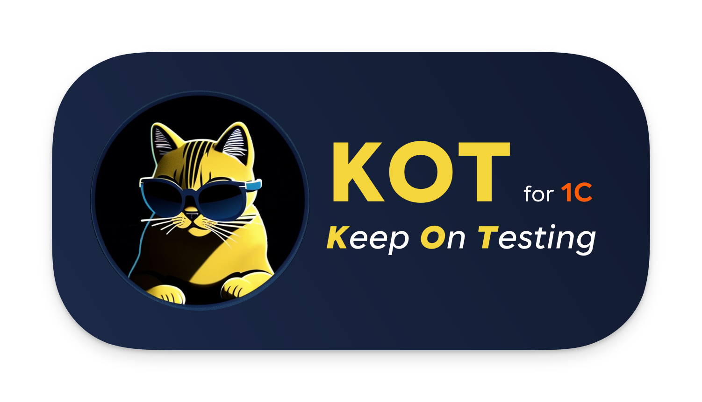
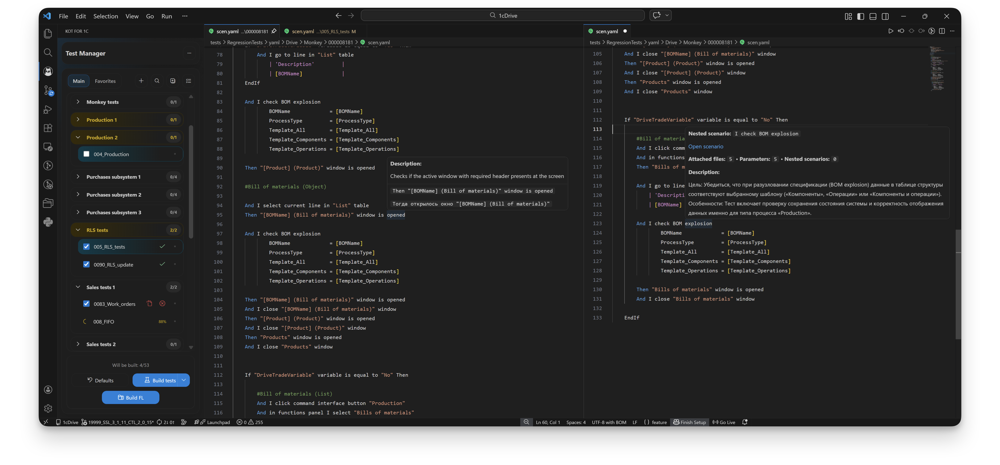
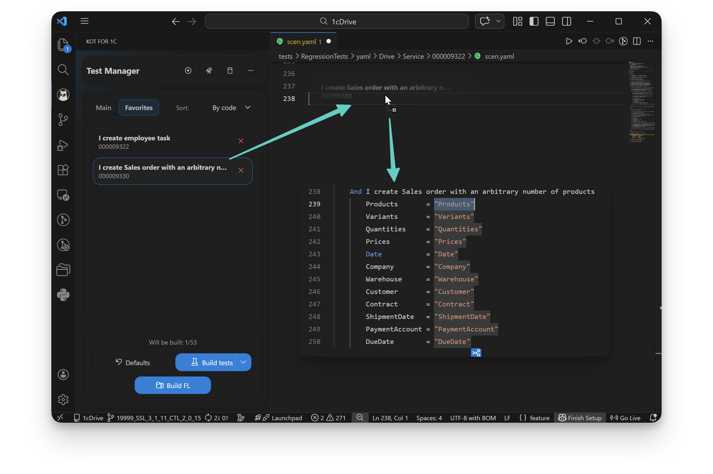
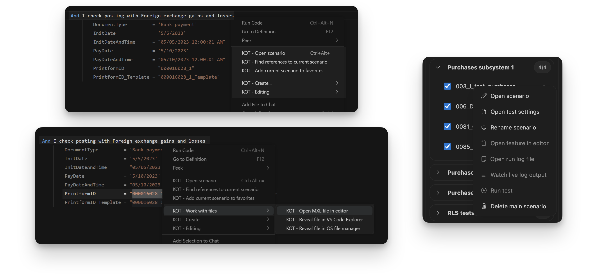
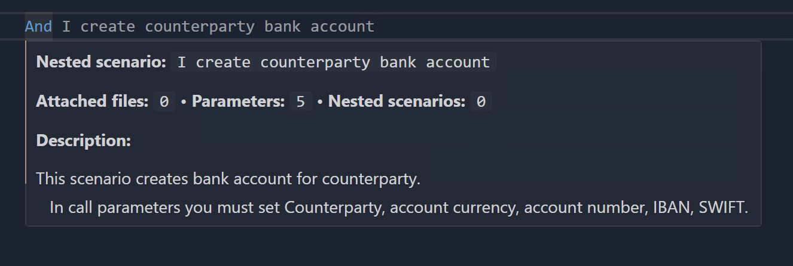
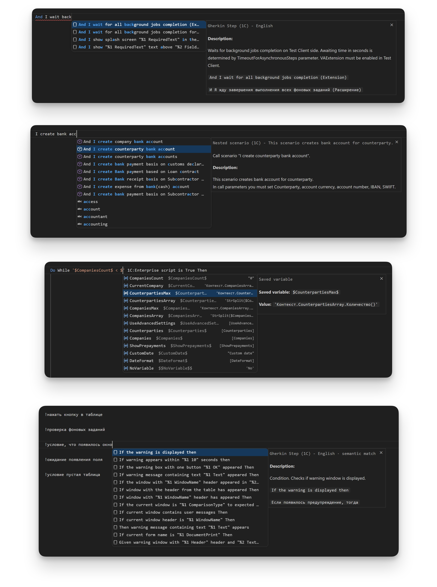
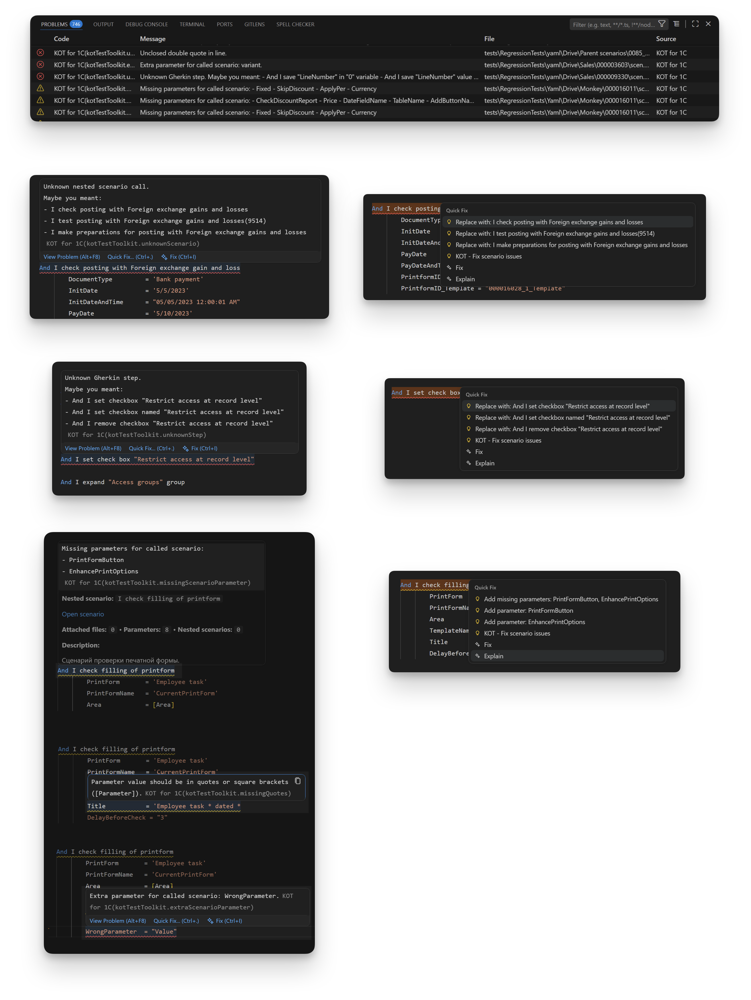
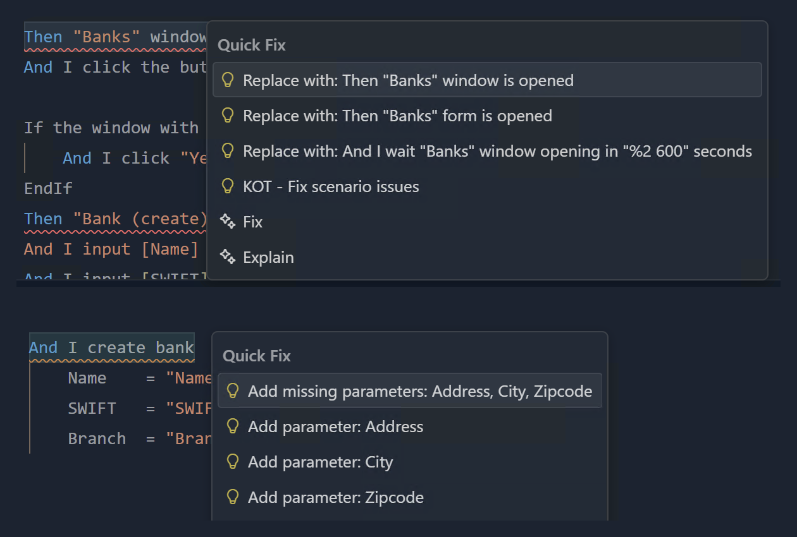
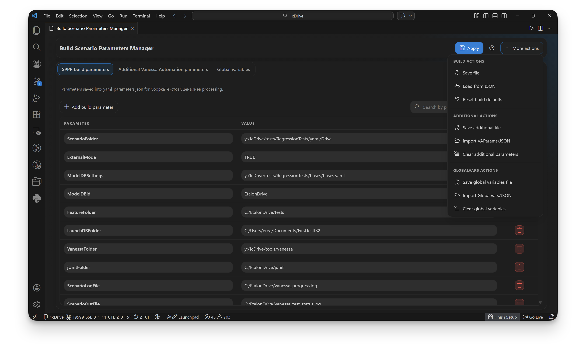

   
  

**KOT** (_**K**eep **O**n **T**esting_) **for 1C** — расширение VS Code для разработки и поддержки автотестов 1С в YAML-формате (экосистема СППР / Vanessa Automation).

Проект начинался внутри 1C:Drive, но сейчас применим в любом 1С-проекте с совместимой структурой сценариев.

## Что дает KOT команде

- Единый контур работы в одном инструменте: «создание -> редактирование -> диагностика -> сборка -> запуск» без переключений между разрозненными утилитами.
- Более быстрый onboarding новых участников: понятная структура сценариев, готовые команды, подсказки и quick fix прямо в редакторе.
- Существенно меньше ручных ошибок в ежедневной рутине: вызовы вложенных сценариев, параметры, переменные, кавычки, служебные секции и форматирование контролируются автоматически.
- Быстрый цикл обратной связи: проблема сразу видна в момент редактирования.
- Предсказуемость сборки и запуска: одинаковый pipeline для всей команды, централизованные настройки и единый формат артефактов (`.feature` + `.json`).
- Прозрачный контроль набора тестов через **Менеджер тестов**: группировка, включение/выключение, избранное и статусы запусков автотестов.
- Удобная масштабируемость тестовой базы: работа с YAML-«кирпичиками» упрощает сопровождение больших наборов сценариев, поддерживает переиспользование тестовых блоков и снижает конфликтность мерджей в репозитории.
- Готовность к реальному процессу: инструмент уже применим в реальном проекте и закрывает путь от авторинга сценария до запуска в Vanessa Automation.

## Для кого

- QA/инженеры автоматизации 1С.
- Команды, которые хотят выстроить автоматизацию тестирования 1С с нуля на базе YAML-сценариев.
- Разработчики, которые поддерживают крупные наборы тестов в YAML.
- Команды, где feature и JSON собираются из сценариев, а не ведутся вручную.

## Ключевые возможности

### 1) Редактор сценариев

- IntelliSense шагов Gherkin (библиотека шагов Vanessa Automation, выгруженная в отдельный файл).
- Интеллектуальные семантические подсказки шагов в IntelliSense по префиксу `!`:
  - можно вводить формулировку желаемого шага своими словами, например: `!условие, что открылось окно`, `!проверка фоновых заданий`, и плагин предложит соответствующие шаги из библиотеки шагов Vanessa Automation;
  - приоритет языка подсказок шагов по тегу `#language:` текущего сценария.
- IntelliSense вызовов вложенных сценариев с параметрами по умолчанию.
- IntelliSense переменных по `$`:
  - переменные, сохраненные выше в сценарии;
  - пользовательские `GlobalVars` из Менеджера параметров.
- IntelliSense и hover работают не только в YAML, но и в `feature`-файлах.
- Hover-подсказки:
  - по шагам — с фактическими аргументами из текущей строки и с эквивалентом на другом языке;
  - по вызовам сценариев — с описанием, числом параметров, вложенных вызовов и файлов.
- Автоматическое выравнивание таблиц Gherkin и параметров вызовов при сохранении.
- Автоматическое заполнение технических блоков (`ПараметрыСценария` и `ВложенныеСценарии`).
- Проверки неизвестных шагов/вызовов, кавычек, блоков `If/Do`, параметров вызовов и неполных секций.
- Предложения `Maybe you meant` для шагов и вызовов вложенных сценариев.
- Быстрые исправления: замена на вариант, добавление недостающих параметров и пакетное исправление типовых проблем.

### 2) Навигация и работа с файлами

- Быстрый переход к вызываемому сценарию из строки вызова.
- Поиск всех мест, где используется текущий сценарий.
- Открытие `.mxl` по выделенному имени через [1С:Предприятие — работа с файлами](https://v8.1c.ru/static/1s-predpriyatie-rabota-s-faylami/).
- Показ найденного файла в Explorer VS Code или в системном проводнике.

### 3) Test Manager (`Менеджер тестов`, бывш. Phase Switcher)

- Создание новых главных и вложенных сценариев.
- Переименование групп и сценариев через контекстное меню.
- Группировка главных сценариев, включение/выключение чекбоксами.
- Поиск по главным сценариям с подсветкой совпадений.
- Выбор чекбоксов сразу учитывается в сборке: автоматически формируются `Exceptscenario` / `Scenariofilter` (без перемещения файлов).
- Подсветка групп и главных сценариев, связанных с текущим открытым файлом (например, вложенный сценарий).
- Вкладка `Избранное`:
  - быстрый доступ к часто используемым сценариям;
  - автоматическое добавление сценариев, созданных текущим пользователем;
  - drag-and-drop в редактор для вставки вызова с параметрами.

### 4) Сборка и запуск Vanessa Automation

- Сборка сценариев через `СборкаТекстовСценариев.epf` (обработка из СППР).
- Генерация `.feature` и `.json` артефактов запуска.
- Кнопка отмены текущей сборки.
- Запуск Vanessa Automation из Test Manager (`Менеджер тестов`):
  - автоматический прогон выбранного теста;
  - запуск окружения VA для ручной отладки (без автопрогона).
- Выбор тестируемой базы для каждого сценария (значение запоминается и предлагается в следующий раз).
- Статусы запуска рядом со сценариями (`running`, `passed`, `failed`, `stale`).
- Live-подсветка шагов в `feature` во время прогона: текущий шаг, пройденные шаги (зеленым), упавший шаг (красным).
- Прогресс прогона по строкам `feature`: проценты и счетчик `x/y` при наведении.
- Live-просмотр лога выполняемого теста и открытие файла лога по результатам теста.

### 5) Менеджер параметров

- Вкладка параметров сборки СППР.
- Вкладка дополнительных параметров Vanessa Automation.
- Вкладка глобальных переменных `GlobalVars`.
- Импорт/экспорт JSON и поиск по параметрам.

## Документация по параметрам

- ИТС: параметры и использование обработки `СборкаТекстовСценариев`  
  [Официальный портал ИТС](https://its.1c.ru/db/sppr2doc#content:124:hdoc)
- Vanessa Automation: JSON-параметры запуска (`VAParams`)  
  [Официальная документация Vanessa Automation](https://pr-mex.github.io/vanessa-automation/dev/JsonParams/JsonParamsRU/)

## Статус и ограничения

- Расширение активно используется и готово к реальному применению.
- Функции полной классификации/менеджмента тестов в стиле СППР реализованы частично и продолжают развиваться.
- Для сборки сценариев необходимо наличие обработки из СППР (подробнее на [ИТС](https://its.1c.ru/db/sppr2doc#content:124:hdoc)).
- Для запуска тестов необходимо наличие [Vanessa Automation](https://github.com/Pr-Mex/vanessa-automation).
- Для работы MXL-команд нужен установленный клиент [1С:Предприятие — работа с файлами](https://v8.1c.ru/static/1s-predpriyatie-rabota-s-faylami/).
- Работа расширения полноценно проверена только на Windows.

## Дисклеймер

Проект не является официальным продуктом фирмы 1С и не аффилирован с ней.
Упоминания 1С/СППР/Vanessa Automation используются только для описания совместимости.

## Благодарности

- Команде тестирования 1C:Drive — за практические идеи, сценарии использования и регулярную обратную связь.
- Команде DevOps 1C:Drive — за поддержку инфраструктуры, CI/CD-практики и помощь с запуском в рабочих контурах.
- Разработчикам [Vanessa Automation](https://github.com/Pr-Mex/vanessa-automation) — за мощный инструмент автоматизации тестирования и открытую документацию.
- Всем участникам сообщества тестирования 1С.

## Куда дальше

- Быстрый старт: [`QUICK_START.md`](./documentation/QUICK_START.md)
- Подробная настройка: [`SETUP.md`](./documentation/SETUP.md)
- Документация по коду: [`DEVELOPMENT.md`](./documentation/DEVELOPMENT.md)
- Функциональные блоки: [`blocks/README.md`](./documentation/blocks/README.md)

## Скриншоты
_На скриншотах продемонстрирован интерфейс на английском языке, но русские переводы так же доступны._

### Интерфейс плагина: 
- Панель Менеджера тестов со статусами прохождения тестов и подсветкой тестов, связанных с текущим открытым файлом;
- Редактор VSCode с описанием написанного шага:

---

- Панель избранных сценариев с результатом Drag-and-drop сценария в редактор:

---

- Команды контекстного меню:

---

- Описание вызываемого сценария:

---

- Описание шагов, сценариев, переменных и семантический поиск шагов в подсказках IntelliSense:

---

### Диагностика и предложения Quick Fix
- Панель Problems со списком предупреждений и ошибок;
- Хайлайт проблемных строк с описанием проблемы:

---

- Меню Quick fix с предложениями на замену:

---

### Менеджер параметров

- Менеджер параметров с открытой вкладкой настроек сборки СППР и меню действий:

---
