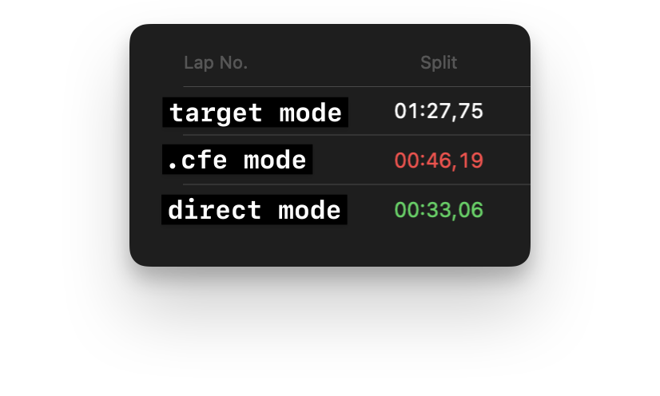

# Блок: KOT Form Explorer (beta)

## Что это

`KOT Form Explorer` — beta-функционал, который состоит из двух частей:

1. webview-панель в VS Code, которая показывает текущую управляемую форму 1С;
2. легковесное runtime-расширение, которое ставится в тестовую базу и пишет snapshot открытой формы в файл; в `cfe` режиме оно дополнительно собирается в пакет `.cfe`.

Результат:

- можно открыть текущую форму прямо в VS Code;
- увидеть активный элемент, имя в интерфейсе, техническое имя, значение и связанные атрибуты;
- быстро перейти к `Form.xml` на строку элемента;
- включать `manual` / `auto` режим обновления;
- искать элемент по клику в интерфейсе 1С;
- читать один настроенный `snapshotPath` как базовый путь; runtime при этом может писать session-specific snapshot рядом с ним, а панель сама резолвит актуальный файл;
- в `manual` режиме отдельно запрашивать snapshot табличных частей.

## Финальная архитектура

Решение построено как гибрид:

- **runtime-слой** снимает snapshot живой формы из клиентской сессии 1С;
- **static-слой** парсит выгрузку `cf` и обогащает snapshot данными из `Form.xml` и metadata;
- **VS Code webview** объединяет оба источника и показывает полноценный инспектор.

### Что делает runtime `.cfe`

Сгенерированное расширение:

- не заимствует прикладные формы;
- добавляет подсистему `KOT Form Explorer`;
- содержит общий клиентский модуль `KOTFormExplorerAdapterClient`;
- инициализируется на старте клиентской сессии через `ManagedApplicationModule`;
- умеет снимать snapshot вручную и автоматически;
- хранит локальные настройки адаптера рядом со сгенерированными артефактами;
- поддерживает `manual` / `auto` режим и переключение режима из 1С и из VS Code.

### Что делает VS Code

Панель:

- читает `form-snapshot.json`;
- читает `adapter-mode.txt`;
- при клике на индикатор режима пишет `adapter-mode-request.txt`;
- сопоставляет runtime-элементы с `Form.xml`;
- умеет открыть или показать в ОС текущий snapshot-файл;
- показывает список UI-элементов, selected element, form attributes и commands;
- блокирует повторный `Start infobase`, пока не закроется запущенный из панели клиент 1С.

## Что нужно на стороне проекта

Минимум:

- доступ к базе, в которую можно установить runtime-расширение Form Explorer;
- исходники конфигурации в файловом формате в `kotTestToolkit.formExplorer.configurationSourceDirectory` для режимов `direct` и `cfe`, а также для static enrichment.

Основную конфигурацию менять не нужно.

## Команды VS Code

- `KOT - Open 1C Form Explorer`
- `KOT - Generate Form Explorer extension project`
- `KOT - Build Form Explorer .cfe`
- `KOT - Install Form Explorer extension into infobase`

## Настройки VS Code

| Настройка | Назначение |
|---|---|
| `kotTestToolkit.formExplorer.snapshotPath` | Путь к `form-snapshot.json` |
| `kotTestToolkit.formExplorer.configurationSourceDirectory` | Каталог исходников конфигурации 1С |
| `kotTestToolkit.formExplorer.generatedArtifactsDirectory` | Каталог сгенерированных артефактов |
| `kotTestToolkit.formExplorer.extensionBuildCommandTemplate` | Необязательный override для внешней сборки `.cfe` |
| `kotTestToolkit.formExplorer.autoRefreshSeconds` | Интервал перечитывания snapshot-а в самой webview |
| `kotTestToolkit.formExplorer.showOutputPanel` | Автопоказ Output при сборке `.cfe` и установке расширения |
| `kotTestToolkit.platforms.catalog` | Каталог платформ 1С для запуска Form Explorer; первая запись используется по умолчанию |
| `kotTestToolkit.platforms.promptForLaunches` | Спрашивать платформу при запуске Form Explorer |

Рекомендуемые значения по умолчанию:

```text
snapshotPath = .vscode/kot-runtime/form-explorer/form-snapshot.json
configurationSourceDirectory = cf
generatedArtifactsDirectory = .vscode/kot-runtime/form-explorer
```

При сборке `.cfe` расширение по умолчанию предлагает сохранить файл внутри `generatedArtifactsDirectory`, обычно как `KOTFormExplorerRuntime.cfe`.

## Режимы установки

- `direct` - самый быстрый режим. KOT берет `configurationSourceDirectory`, генерирует runtime и загружает его прямо в выбранную базу. **Использовать его стоит только когда база соответствует текущей ветке или хотя бы не сильно отличается от нее.**
- `cfe` - промежуточный режим. KOT тоже берет `configurationSourceDirectory`, но сначала собирает или переиспользует `.cfe` через отдельную builder-ИБ, а уже потом ставит его в выбранную базу. Это медленнее `direct`, зато обычно предсказуемее.
- `target` - самый медленный, но самый точный режим. KOT сначала выгружает конфигурацию самой выбранной базы, генерирует runtime уже по этой выгрузке и затем устанавливает его обратно в ту же базу. Для файловых баз KOT сначала пытается использовать `ibcmd infobase config export`, а при недоступности `ibcmd` или ошибке автоматически возвращается к выгрузке через Designer.

_В режимах `direct` и `cfe` источник сборки адаптера берется из `configurationSourceDirectory`. В режиме `target` источником генерации становится выгрузка конфигурации самой выбранной базы._


<p align="center"><span>Время в секундах от начала запуска базы из Form Explorer до фактического открытия окна Предприятия при установке расширения:</span><br>
</p>

## One-click flow

### 1. Открыть KOT Form Explorer

Панель `Test Manager` -> `...` -> `Open KOT Form Explorer` или команда `KOT - Open 1C Form Explorer`.

### 2. Запустить базу для отслеживания

1. В открывшемся окне нажать `Start infobase`;
2. Выбрать существующую файловую или серверную базу из общего списка менеджера баз (`launcher`, `runtime`, `snapshot`, `manual`, `workspaceState`) или указать путь вручную;
3. (_Если требуется_) Ввести имя пользователя базы и пароль;
4. В выборе режима запуска доступны варианты:
   `Start with installed extension`, если адаптер уже установлен и его не нужно обновлять;
   `Direct ... (Recommended)` для быстрой установки/переустановки;
   `Build/install via .cfe ...` для промежуточного сценария совместимости;
   `Build from target infobase ...` для самого точного сценария, когда база не соответствует текущей ветке;
5. Выбрать режим по правилам из раздела `Режимы установки`;
6. Дождаться открытия базы.

### 3. Начать пользоваться исследователем формы

После появления snapshot-а список элементов должен наполниться по текущей открытой форме (стартовой странице 1С). Панель использует один настроенный `kotTestToolkit.formExplorer.snapshotPath` как базовый путь и сама находит актуальный session-specific snapshot runtime-адаптера, поэтому дополнительный выбор snapshot в интерфейсе не нужен.

При необходимости файловую базу можно заранее подготовить через команду `KOT - Open Infobase Manager`: создать новую, пересоздать существующую, выгрузить/восстановить `DT`, обновить конфигурацию и затем использовать ту же базу в `Start infobase`.

Альтернативно старт можно сделать прямо из `KOT Infobase Manager` кнопкой `Start Form Explorer` у выбранной базы: менеджер откроет панель `KOT Form Explorer`, передаст туда эту базу и учтет per-base launch keys, если они заданы.

Пока запущенный клиент 1С не закрыт, кнопка `Start infobase` в панели остается недоступной. Это защищает от повторного запуска поверх уже открытой сессии Form Explorer.

## Настройки адаптера в 1С

Расширение конфигурации (адаптер) создает свою подсистему. В ней есть команда `KOT Form Explorer settings`.

Там настраиваются:

- `Snapshot path` - кастомный путь до файла состояния формы;
- `Hotkey preset` - комбинация клавиш для ручного снятия состояния формы, находясь в окне 1С (опциональный вариант, так как обновление можно запрашивать из интерфейса VSCode);
- `Auto snapshot` - режим снятия состояния формы. Переключается либо тут, либо в интерфейсе VSCode;
- `Interval` - интервал автообновления снятия состояния формы.

### Доступные preset-шорткаты

- `Ctrl+Shift+F12`
- `Ctrl+Alt+F12`
- `Alt+Shift+F12`
- `Ctrl+Shift+F11`
- `Disabled`

### Дополнительный hotkey

- `Ctrl+Alt+F11` — переключение `manual` / `auto`

## Режимы обновления

### Manual

Snapshot обновляется только по ручному действию:

- выбранный preset-hotkey;
- команда обновления из runtime;
- ручной refresh в VSCode;
- поиск элемента по клику из VSCode (локатор);
- отдельный запрос состояния табличной части по кнопке.

### Auto

Адаптер периодически проверяет форму и записывает snapshot автоматически.

Чтобы случайно не подвешивать клиент на каждом тике, auto-режим получает:

- текущая форма;
- активный элемент;
- значения элементов;
- без табличных частей (как в manual режиме, они запрашиваются отдельно).

Полный snapshot строится только если форма изменилась.

## Переключение режима из VS Code

В шапке панели есть индикатор `Update mode`.

Схема работы:

1. VS Code пишет запрос в `adapter-mode-request.txt`;
2. адаптер 1С читает request-файл;
3. применяет новый режим;
4. подтверждает фактическое состояние через `adapter-mode.txt`.

Такой handshake надежнее, чем запись обоими сторонами в один и тот же файл.

## Файлы runtime

В `generatedArtifactsDirectory` используются:

| Файл | Назначение |
|---|---|
| `form-snapshot.json` | Последний snapshot формы |
| `adapter-settings.json` | Локальные настройки адаптера |
| `adapter-mode.txt` | Фактический режим адаптера (`manual` / `auto`) |
| `adapter-mode-request.txt` | Запрос от VS Code на переключение режима |
| `adapter-request-context.json` | Контекст последнего запроса от панели (`refresh`, `table`, `locator`, `mode`) |
| `forms-index.json` | Статический индекс управляемых форм |
| `build-manifest.json` | Манифест последней генерации проекта адаптера |
| `extension-src/` | Сгенерированное дерево исходников расширения |
| `builder-infobase/` | Кэшированная builder-ИБ для встроенной сборки вне выбранной базы (на основании конфигурации репозитория) |
| `builder-base-state.json` | Stamp состояния основной конфигурации |
| `build-logs/` | Логи шагов генерации, сборки и установки |

## Встроенная сборка и сохранение `.cfe` адаптера

1. создается файловая builder-ИБ или переиспользуется существующая;
2. основная конфигурация загружается туда только при изменении содержимого `configurationSourceDirectory`;
3. generated extension загружается через `-Extension`;
4. `.cfe` выгружается через `DumpCfg -Extension`, а затем кешируется по fingerprint входов сборки.

Это сильно ускоряет повторные сборки и используется именно в режиме `cfe`. В режимах `direct` и `target` этот промежуточный `.cfe` шаг пропускается.

## Что показывает панель

### Elements

`Elements` — это реальные UI-контролы формы:

- поля;
- кнопки;
- вкладки;
- группы;
- контейнеры.

Это основной рабочий слой.

### Form attributes

_По умолчанию скрыто, чтобы показать, надо включить Technical info в меню `...`_

`Form attributes` — это данные формы, на которые ссылаются UI-элементы:

- `Object.Counterparty`
- `Object.BasisDocument`
- временные реквизиты формы
- вычисляемые атрибуты

Этот блок полезен как диагностический слой, а не как основной навигатор.

### Commands

_По умолчанию скрыто, чтобы показать, надо включить Technical info в меню `...`_

`Commands` — это действия формы, доступные в текущем snapshot-е.

Они нужны в основном для анализа поведения формы и привязанных действий.

## Формат snapshot-а

Минимальный контракт:

```json
{
  "schemaVersion": 1,
  "generatedAt": "2026-03-20T10:15:00.000Z",
  "form": {
    "title": "Sales order 0000-000001 dated 5/5/2019",
    "windowTitle": "Sales order 0000-000001 dated 5/5/2019",
    "name": "DocumentForm",
    "metadataPath": "Document.SalesOrder.Form.DocumentForm",
    "type": "ManagedForm",
    "activeElementPath": "Client application form.Header.HeaderLeft.Counterparty"
  },
  "elements": [],
  "tables": [],
  "attributes": [],
  "commands": []
}
```

### Поддерживаемые ключевые поля элемента

- `path`
- `name`
- `title`
- `synonym`
- `kind`
- `type`
- `boundAttributePath`
- `valuePreview`
- `tableData` (for table/list controls; includes `columns`, `rows`, `rowCount`, `truncated`)
- `active`
- `visible`
- `enabled`
- `available`
- `readOnly`
- `metadataPath`
- `source`
- `children`

### Поддерживаемые ключевые поля snapshot

- `tables` (optional list of detected form tabular sources; each item may contain `path`, `title`, `elementPath`, `boundAttributePath`, `sourcePath`, `tableData`)

## Ограничения

- Решение рассчитано на управляемые формы.
- На данный момент не вычисляются `DynamicList` списки.
- Часть форм может требовать дополнительных fallback-ов.
- После изменений в webview расширения достаточно перезагрузить окно VS Code.
- После изменений в адаптере нужно заново сгенерировать и переустановить runtime-расширение; в `cfe` режиме это означает пересборку `.cfe`.
- Процесс проверялся только на Windows.

## Где смотреть дальше

- [`README.md`](../../README.md)
- [`documentation/DEVELOPMENT.md`](../DEVELOPMENT.md)
